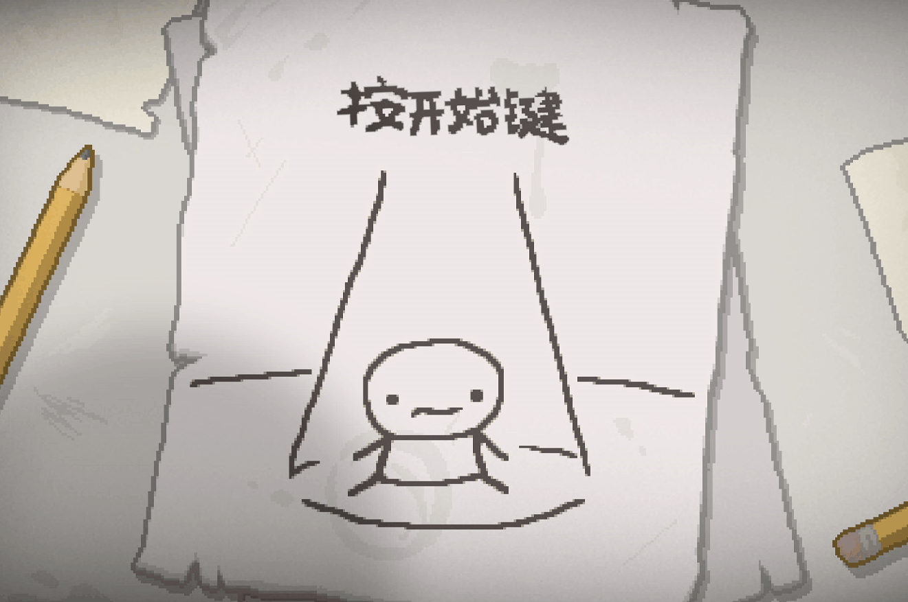
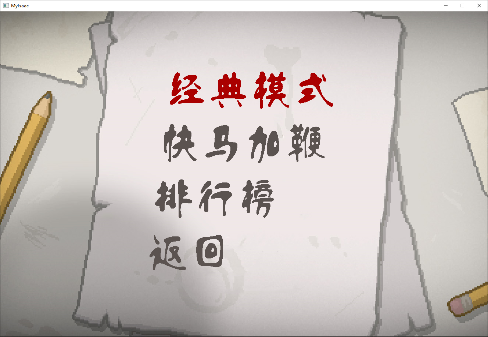
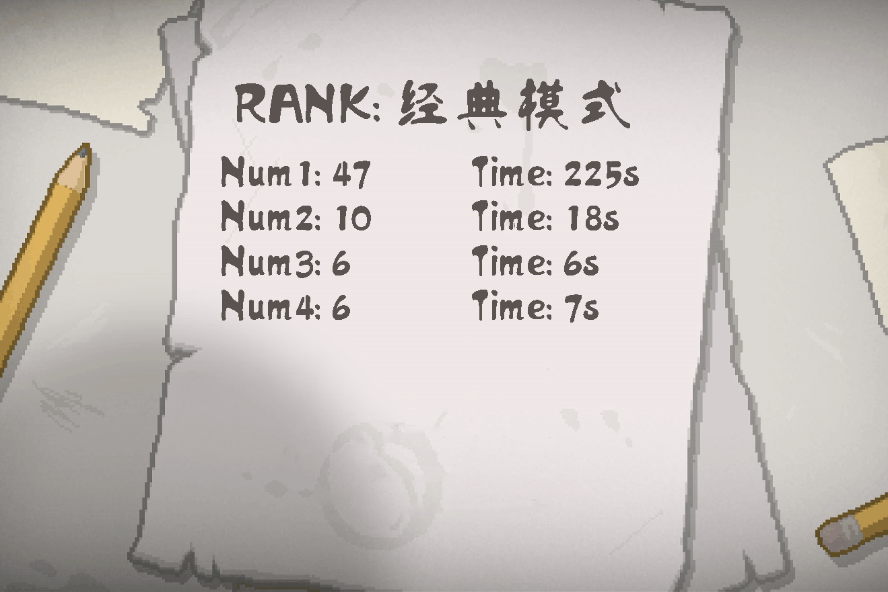

# EasyIsaac（学习项目）

[-blue.svg)](https://isocpp.org/)
[](https://easyx.cn/)
[]()
[](https://creativecommons.org/licenses/by/4.0/)

## 简介 (Introduction)

本项目 `EasyIsaac` 是一个基于 **EasyX** 图形库实现的 **C++ 射击小游戏**，作为 **大一 C 语言课程设计** 完成。游戏的核心玩法和视觉风格模仿了著名的独立游戏 **《以撒的结合》(The Binding of Isaac)**。

虽然项目使用 C++ 编译（因为 EasyX 库的要求），但代码风格基本遵循 C 语言语法。

**注意:** 本项目作为课程设计已经完成，作者目前没有计划进行后续更新和维护。

## 特性 (Features)

* 基于 EasyX 实现的 2D 图形渲染。
* 模仿《以撒的结合》的俯视角射击玩法。
* 包含角色移动、子弹发射与碰撞检测。
* 使用掩码图技术实现部分图片的透明效果。
* 包含简单的地图生成逻辑（目前为单个房间）。
* 集成了简单的音效和背景音乐播放 (使用 `mciSendString`)。
* 使用了自定义字体（方正流行体_GBK）用于界面显示。
* 支持显示碰撞箱（调试功能）。

## 截图 (Screenshots)

开始界面：


游戏主菜单：


游戏画面(实际画面为60帧)：


排行榜：


## 操作说明 (Controls)

* **移动 (Movement):** `W` `A` `S` `D`
* **射击 (Shoot):** `↑` `↓` `←` `→` (方向键)
* **返回 / 暂停 (Back / Pause):** `Esc`
* **确定 (Confirm):** `Space` (空格键) 或 `Enter` (回车键)
* **显示/隐藏碰撞箱 (Toggle Hitboxes):** `U`

## 技术栈与依赖 (Tech Stack & Dependencies)

* **语言 (Language):** C++ (主要使用 C 风格语法)
* **图形库 (Graphics Library):** EasyX (官网: [easyx.cn](https://easyx.cn/))
* **核心库 (Core Libraries):**
    * `<easyx.h>`
    * `<stdio.h>`
    * `<stdlib.h>`
    * `<time.h>`
    * `<math.h>`
    * `<shlobj.h>` (用于特定 Windows 功能)
    * `winmm.lib` (通过 `#pragma comment(lib, "winmm.lib")` 链接，用于多媒体功能，如声音播放)
* **开发环境 (IDE):** Visual Studio 2022
* **操作系统 (OS):** Windows

## 安装与运行 (Setup & Run)

1.  **环境准备:**
    * 确保你的操作系统是 **Windows**。
    * 安装 **Visual Studio 2022** ([下载地址](https://visualstudio.microsoft.com/zh-hans/vs/))。
    * 下载并安装 **EasyX** 库。前往 EasyX 官网 ([easyx.cn/t/download](https://easyx.cn/t/download)) 下载最新版的安装程序（通常是一个 `.exe` 文件），运行它会自动检测并安装到你的 Visual Studio 2022 中。

2.  **获取项目:**
    * 克隆或下载本仓库到本地。

3.  **配置 Visual Studio:**
    * 使用 Visual Studio 2022 打开项目根目录下的 `MyIsaac.sln` 文件。
    * 在 VS 中，右键点击解决方案资源管理器中的项目（例如 "MyIsaac"），选择“属性”。
    * 在属性页中，确保配置为“所有配置”（或你常用的 Debug/Release 配置），平台为“所有平台”（或你常用的 x86/x64）。
    * 导航到 **配置属性 -> 高级 -> 字符集**。
    * 将其设置为 **“使用多字节字符集”**。点击“应用”并“确定”。

4.  **编译与运行:**
    * 一般来说，直接点击“本地 Windows 调试器”（或按F5）即可运行，无需以下步骤。
    * 在 Visual Studio 2022 中，选择“MyIsaac”启动项目。
    * 点击顶部菜单的“生成”->“生成解决方案”（或按 F7）。
    * 如果编译成功，点击绿色的“本地 Windows 调试器”按钮（或按 F5）运行游戏。程序将执行 `src/main.cpp`。

## 项目结构 (Project Structure)

```
EasyIsaac/
├── assets/                     # 资源文件
│   ├── fonts/                  # 字体文件
│   │   └── 方正流行体_GBK.TTF  # 主菜单等使用的字体
│   ├── images/                 # 图片贴图
│   │   ├── bullet/             # 子弹图片 (前后景用于透明效果)
│   │   ├── character/          # 角色图片 (前后景用于透明效果)
│   │   └── ...                 # 其他 (怪物、障碍物等)
│   └── sounds/                 # 音效和音乐文件
│       ├── dead.mp3
│       └── ...
├── src/                        # 源代码
│   ├── main.cpp                # 主程序入口，游戏循环，渲染，事件处理，资源管理
│   ├── room.cpp                # 房间/地图管理 (地图生成, BFS寻路算法)
│   ├── tool.cpp                # 工具函数 (按键检测, 定时器, 数学函数等)
│   └── 标头.h                  # 头文件 (结构体定义, 全局变量声明, 函数原型)
└── EasyIsaac.sln               # Visual Studio 解决方案文件 (使用 VS2022 打开)
```

* **assets/images**: 图片资源主要来源于游戏《以撒的结合》，部分经过了修改（如 Photoshop 处理）。透明效果是通过同时加载背景图 (`_back.jpg`) 和掩码图 (`_front.jpg`) 来实现的。
* **assets/sounds**: 音效和音乐文件同样来源于《以撒的结合》。
* **src/**: 代码文件的详细功能划分请参考文件内的注释或以下概览：
    * **main.cpp**: 游戏主逻辑，包括初始化、资源加载/释放、游戏循环、状态更新、渲染（角色、障碍物、UI）、事件处理（移动、射击）、碰撞检测。
    * **room.cpp**: 负责地图相关的功能，如使用 BFS 算法进行寻路或地图生成逻辑。
    * **tool.cpp**: 提供各种辅助功能，例如精确的按键检测、计时器、数学运算（如返回最大值）、坐标转换等。
    * **标头.h**: 定义了整个项目共享的数据结构（游戏状态、房间状态、玩家状态、实体链表节点、子弹链表节点等）、常量、全局变量声明以及所有主要函数的原型。

## 已知问题与局限性 (Known Issues & Limitations)

* **音效播放:** 使用 `mciSendString` 播放音效时，同一个音效无法重叠播放，必须等待当前播放完成后才能再次触发播放同一个音效。
* **按键监听:** 游戏窗口即使不在前台（非活动窗口）时，仍然会响应键盘输入。
* **游戏内容:** 目前游戏只有一个固定房间，没有实现《以撒的结合》中进入不同房间的机制。
* **敌人/Boss:** 缺乏复杂的敌人行为和 Boss 战。
* **开发状态:** 项目已停止开发，不太可能进行功能更新或 Bug 修复。

## 未来计划 (Future Plans - Archived)

虽然目前没有计划继续开发，但最初设想的或可以改进的方向包括：

* 实现多房间系统，允许玩家探索不同的房间布局。
* 增加更多种类的敌人和具有挑战性的 Boss。
* 引入道具和能力系统。
* 修复已知的音效和按键监听问题。
* 使游戏机制更贴近原版《以撒的结合》。

## 许可证 (License)

本项目采用 **知识共享署名 4.0 国际许可协议 (Creative Commons Attribution 4.0 International License - CC BY 4.0)** 进行许可。

## 贡献 (Contributing)

本项目是作为大学课程设计完成的，已停止维护。

但是，本项目基于 **CC BY 4.0** 许可证开放源代码。欢迎您自由地 Fork、学习、修改和使用本项目的代码。

## 致谢 (Acknowledgements)

* 感谢 **Edmund McMillen** 和 **Florian Himsl** 创作了伟大的游戏 **《以撒的结合》**，为本项目提供了灵感来源和部分资源。
* 感谢 **EasyX** 图形库 ([easyx.cn](https://easyx.cn/)) 的开发者，使得在 C++ 中进行简单的图形编程成为可能。

## 联系方式 (Contact)

如果你对本项目有任何疑问，可以通过以下方式联系作者：

* 邮箱: `2519521987@qq.com`